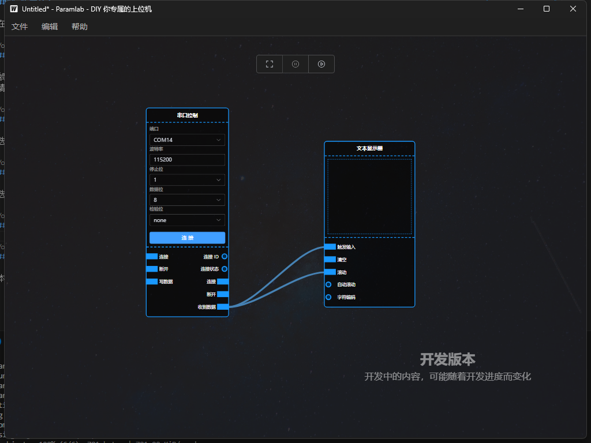

# ParamLab - DIY 属于自己的上位机

## 介绍

ParamLab 提供了一个全新的上位机模式，不同于传统上位机，ParamLab 采用了一种类似于 UE4 蓝图的可视化编程模式。
这一模式可以将编程与数据展示无缝结合，即使你没有什么编程经验，也可以通过鼠标连接节点的方式快速组合出一个满足自定义需求的上位机。

## 开发

### 环境

本项目基于 wails 框架，请参考[wails文档](https://wails.io/zh-Hans/docs/gettingstarted/installation)安装 wails 环境。

### 开发模式运行

```bash
wails dev
```

### 编译

```bash
wails build
# 也可以使用 upx 压缩，体积更小
wails build -upx
```

### 技术栈

- element-plus 提供部分组件
- retejs 提供可视化编程框架
- vue3 + typescript + vite 基础框架
- wails 提供跨平台支持

## 使用

### 下载和安装

请前往 [release](https://github.com/hempflower/ParamLab/releases) 页面下载最新版本。

在较新版本的 windows 10 或者 windows 11 中，可以直接运行此程序，无需安装任何依赖。   
在旧版本的 windows 中，需要安装 webview2 运行时，下载地址：[https://developer.microsoft.com/en-us/microsoft-edge/webview2/](https://developer.microsoft.com/en-us/microsoft-edge/webview2/)

Linux 与 macOS 理论上是支持的，但是未经过测试，欢迎尝试，如有问题请提 issue。

### 编辑节点

#### 新建节点

在编辑器区域鼠标右键，选择需要添加的节点类型。节点将添加到鼠标位置。

#### 连接节点

鼠标左键拖动一个节点的输出端口到另一个节点的输入端口，即可连接两个节点。    
请注意，节点并非所有的输出端口都可以连接到所有的输入端口，只有类型匹配的端口才可以连接。

#### 运行

选择点击编辑器悬浮工具栏的运行按钮，即可运行当前的节点组合。

#### 保存

选择 "文件"->"保存" 即可保存当前的节点组合。保存的文件为 json 格式，可以使用文本编辑器打开。

## 截图




## 许可证

本项目使用 GPL v3 许可证，详见 [LICENSE](LICENSE) 文件。